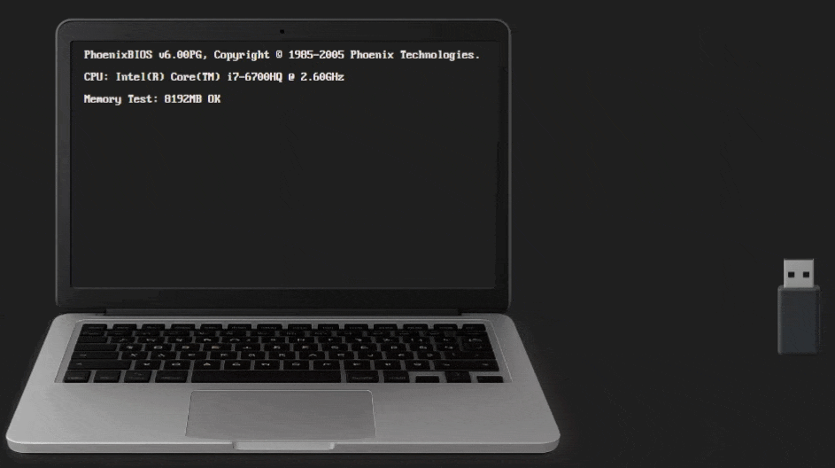
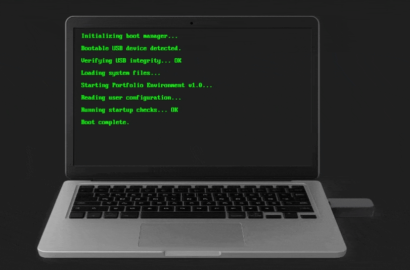
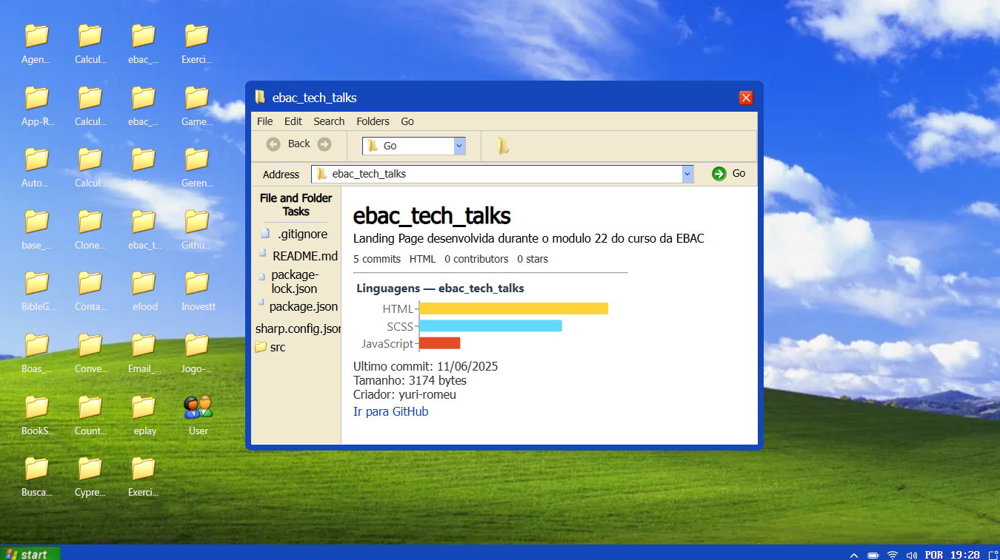

# 💻 Portfólio Interativo - Simulação de Windows XP

Bem-vindo ao **meu portfólio pessoal**, um projeto interativo que recria a experiência de inicializar um computador antigo e explorar pastas dentro de um **Windows XP simulado**.  
Cada pasta representa um projeto hospedado no meu GitHub, alimentado automaticamente pela **API do GitHub** através do **RTK Query**.

---

## 🧠 Visão Geral

O projeto começa com uma **simulação de BIOS**, onde o visitante pode "inserir um pendrive" e pressionar **F11** para inicializar o sistema.  
Após o boot, é carregada uma interface inspirada no **Windows XP**, completa com ícones, janelas, modais e tudo que lembra o velho windows XP.

Dentro do "sistema", o usuário pode:
- Explorar pastas que representam repositórios reais do GitHub.
- Abrir modais com informações sobre cada projeto (descrição, linguagens, último commit e mais).
- Visualizar um design retrô e interativo, mas com uma estrutura moderna em **React + TypeScript**.

---

## 🧩 Tecnologias Utilizadas

| Tecnologia | Função |
|-------------|--------|
| ⚛️ **React** | Interface interativa e componentizada |
| ⚡ **Vite** | Build rápido e leve |
| 🔄 **Redux Toolkit (RTK Query)** | Comunicação com a API do GitHub |
| 💅 **Styled Components** | Estilização dinâmica e reutilizável |
| 🧠 **TypeScript** | Tipagem e segurança de código |
| 📡 **GitHub API** | Fornece os dados reais dos repositórios |

---

## 🚀 Funcionalidades Principais

- 🖥️ **Simulação completa de boot e BIOS**
- 🪟 **Interface fiel ao Windows XP**
- 📂 **Listagem automática de repositórios do GitHub**
- 🧑‍💻 **Exibição de dados técnicos:**
  - Nome e descrição do repositório  
  - Linguagem principal  
  - Tamanho, estrelas e contribuições  
  - Data do **último commit**  
  - Autor do projeto  
  - Tamanho do repositório em KB
- 🧰 **Sistema de modais e pastas interativas**
- 🔄 **Fácil adaptação para qualquer usuário do GitHub**

---

## 🧑‍🔧 Como Executar o Projeto Localmente

1. **Clone o repositório:**
   ```bash
   git clone git@github.com:Yuri-Romeu/Portfolio.git
   ```
2. **Acesse a pasta:**
   ```bash
   cd portfolio
   ```
3. **Instale as dependências:**
   ```bash
   npm install
   ```
4. **Crie um arquivo .env na raiz e adicione:**
   ```bash
   VITE_GITHUB_TOKEN=seu_token_githubApi
   ```
5. **Inicie o projeto:**
   ```bash
   npm run dev
   ```
---
## 🧩Como Adaptar para Seu Próprio Portfólio

Este projeto foi feito para ser altamente reutilizável.
Com poucas alterações, qualquer desenvolvedor pode transformá-lo em seu próprio portfólio:

1. **Edite o arquivo** `.env` e substitua VITE_GITHUB_TOKEN pelo seu token do GitHub.
2. **Nas variaveis** `"usuario"` coloque seu nome do GitHub

*Opcional: mude o tema visual nas variáveis de cor dos Styled Components.*

**Em segundos, seu portfólio estará totalmente conectado à sua conta GitHub e rodando com sua identidade visual.**

---

## 📂 Estrutura do Projeto

```
📁 raiz-do-projeto
 ┣ 📂 src
 ┃ ┣ 📂 Pages
 ┃ ┣ 📂 assets/fonts&images
 ┃ ┣ 📂 components
 ┃ ┣ 📂 containers
 ┃ ┗ 📂 services
 ┃ ┗ 📂 store
 ┣ 📱 App.tsx
 ┣ 📱 main.tsx
 ┣ 🎨 styles.ts
 ┣ 🧭 routes.ts
 ┣ 🧩 types.d.ts
 ┣ 📜 package.json
 ┣ 📜 README.md
 ┗ ...
```
---

## 🖼️ Preview do Projeto

<p align="center">
  
  
  
</p>

---

## 📡 API Utilizada

*Os dados são obtidos diretamente da [GitHub REST API](https://docs.github.com/en/rest), com endpoints como:*

- `GET /users/{username}/repos` → lista de repositórios

- `GET /repos/{username}/{repo}` → detalhes do repositório

- `GET /repos/{username}/{repo}/commits` → último commit, autor e data

Essas chamadas são gerenciadas de forma otimizada com RTK Query, garantindo cache, refetch e performance aprimorada.

---

## 🧪 Testes

```bash
# Rodar os testes
npm test
```
---

## 💻 Hospedagem do projeto

Veja o projeto no seu dispositivo. [Portfolio](https://portfolio-yuriromeus-projects.vercel.app/)

---

## 👨‍💻 Desenvolvedor

* **Yuri Romeu**


 [Yuri-Romeu](https://www.linkedin.com/in/YuriRomeu) | [GitHub](https://github.com/Yuri-Romeu)

---

## 🧾 Licença
```
Este projeto é distribuído sob a licença MIT, o que significa que você pode usá-lo, modificá-lo e distribuí-lo livremente — desde que mantenha os créditos originais.
```


